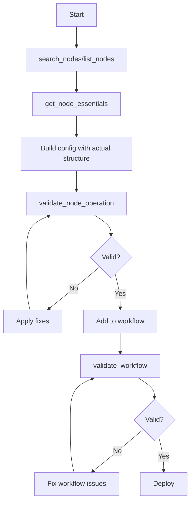

# MCP Validation Patterns for n8n Workflows

## Core Principle: Dynamic Over Static
Never hardcode node configurations, versions, or parameter structures. Always use MCP tools to get current, accurate information directly from n8n.

## Pattern 1: Always Validate Before Building

```javascript
async function buildNode(nodeType) {
  // 1. Get actual structure from n8n
  const essentials = await get_node_essentials(nodeType)
  
  // 2. Build config using real structure
  const config = {
    type: essentials.workflowNodeType,
    typeVersion: essentials.version,  // Actual version, not guessed
    parameters: {} // Fill based on essentials.commonProperties
  }
  
  // 3. Validate configuration
  const validation = await validate_node_operation(nodeType, config)
  
  // 4. Apply automatic fixes
  if (!validation.isValid) {
    Object.assign(config, validation.fixes)
  }
  
  return config
}
```

## Pattern 2: Use Templates for Common Tasks

```javascript
// Instead of building from scratch with potentially wrong structure
const webhookConfig = await get_node_for_task('receive_webhook')
const llmConfig = await get_node_for_task('basic_llm_chain')
const slackConfig = await get_node_for_task('send_slack_message')

// These templates are pre-validated and always current
```

## Pattern 3: Workflow-Level Validation

```javascript
// After building entire workflow
const validation = await validate_workflow(workflow)

if (!validation.valid) {
  console.log('Errors:', validation.errors)
  console.log('Warnings:', validation.warnings)
  console.log('Suggested fixes:', validation.suggestions)
  
  // Apply fixes systematically
  validation.errors.forEach(error => {
    if (error.fix) {
      // Apply the suggested fix
      applyFix(workflow, error)
    }
  })
}
```

## Pattern 4: Discover Actual Parameter Structure

```javascript
// For LangChain nodes - Don't assume structure!
const essentials = await get_node_essentials('nodes-langchain.chainLlm')

// Check what the actual structure is:
essentials.commonProperties.forEach(prop => {
  console.log(`Property: ${prop.name}`)
  console.log(`Type: ${prop.type}`)
  console.log(`Structure:`, prop)
})

// Build config based on ACTUAL structure, not assumptions
```

## Pattern 5: Credential Key Discovery

```javascript
// Don't guess credential key names
const nodeInfo = await get_node_essentials('nodes-langchain.lmChatGoogleGemini')

// Find actual credential key from metadata
if (nodeInfo.metadata.hasCredentials) {
  // The essentials will show the correct credential type
  // e.g., googlePalmApi, not googleGenerativeAiApi
}
```

## Pattern 6: Operation-Specific Validation

```javascript
// Different operations need different fields
const slackConfig = {
  resource: 'message',
  operation: 'post',
  channel: '#general',
  text: 'Hello'
}

// Validate for specific operation
const validation = await validate_node_operation(
  'nodes-base.slack',
  slackConfig,
  'runtime'  // Use appropriate profile
)

// The validator knows what fields THIS operation needs
```

## Pattern 7: Progressive Validation Profiles

```javascript
// During development - fast feedback
validate_node_operation(nodeType, config, 'minimal')

// Before testing - standard validation
validate_node_operation(nodeType, config, 'runtime')

// For AI-generated configs - AI-friendly validation
validate_node_operation(nodeType, config, 'ai-friendly')

// Before production - strict validation
validate_node_operation(nodeType, config, 'strict')
```

## Pattern 8: Expression Validation

```javascript
// Validate n8n expressions in workflow
const expressionValidation = await validate_workflow_expressions(workflow)

if (expressionValidation.errors.length > 0) {
  expressionValidation.errors.forEach(error => {
    console.log(`Invalid expression at ${error.location}: ${error.message}`)
  })
}
```

## Common Mistakes to Avoid

### ❌ DON'T: Hardcode versions
```javascript
// WRONG
const node = {
  typeVersion: 1.4,  // This might be wrong!
  ...
}
```

### ✅ DO: Get actual version
```javascript
// RIGHT
const essentials = await get_node_essentials(nodeType)
const node = {
  typeVersion: essentials.version,  // Always current
  ...
}
```

### ❌ DON'T: Assume parameter structure
```javascript
// WRONG - Assuming Basic LLM Chain structure
parameters: {
  options: {
    systemMessage: "..."  // This structure might be wrong!
  }
}
```

### ✅ DO: Use actual structure
```javascript
// RIGHT - Get real structure
const essentials = await get_node_essentials('nodes-langchain.chainLlm')
// Build parameters based on essentials.commonProperties
```

### ❌ DON'T: Guess credential keys
```javascript
// WRONG
credentials: {
  googleGenerativeAiApi: {...}  // Key name might be wrong!
}
```

### ✅ DO: Check essentials for correct key
```javascript
// RIGHT
const essentials = await get_node_essentials(nodeType)
// Use the credential key shown in essentials
```

## Validation Flow Summary



## Key MCP Tools Reference

- **get_node_essentials(nodeType)**: Get actual structure, version, credential keys
- **validate_node_operation(nodeType, config, profile)**: Validate and get fixes
- **get_node_for_task(task)**: Get pre-validated templates
- **validate_workflow(workflow)**: Full workflow validation
- **validate_workflow_connections(workflow)**: Check connections only
- **validate_workflow_expressions(workflow)**: Validate expressions
- **search_node_properties(nodeType, property)**: Find specific properties

## Remember

> **The ground truth is always in the MCP tools, not in documentation.**
> 
> Documentation can become outdated, but MCP tools query n8n directly for current information.